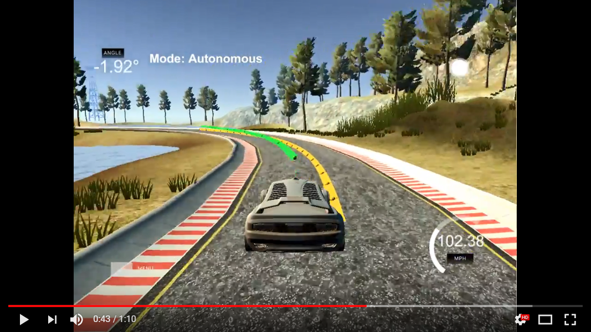
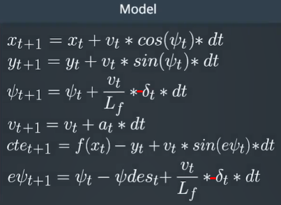

# CarND-Controls-MPC
Self-Driving Car Engineer Nanodegree Program

---
## 1. Run System
 
Command: ./mpc 140 50 300 1 1 1 500 5 30 0.3 0.3

## 2. Output Video

Performance: max speed 108MPH on the straights.

[](https://youtu.be/uFqQtsL1MkU)

## 3. Implementation

I get a good process description about MPC in this [document](http://cse.lab.imtlucca.it/~bemporad/teaching/mpc/imt/1-mpc.pdf).
> MPC uses a simplified dynamical model of the process to predict its likely future evolution and choose **a good** control action.

### 3.1. The Model

#### 3.1.1. Vehicle  Model

This picture is a vehicle model, but in this project, because of the inconsistent angle of the simulator, need to invert delta_t(steer_value).



#### 3.1.2. States

There are 6 states in this project. Note that the simulator return steer_value in [-0.46332, +0.46332] radians here. The value here is only obtained from the simulator, and the latency of the simulator needs to be considered. The final input state is calculated by the veichle model.

```c++
  double px = j[1]["x"];
  double py = j[1]["y"];
  double psi = j[1]["psi"];
  double v = j[1]["speed"];
```

After the waypoints coordinate transformation, and after fitting out the trajectory line and considering the latency, cte and epsi are obtained from the following formulas.

```c++
  double cte = polyeval(coeffs,0);
  double epsi = - atan(coeffs[1]);
```

#### 3.1.3. Actuators

The car simplifies all actuator devices to steering and acceleration. Although the throttle here is not an acceleration value, we can roughly think that it is.

```c++
  /* The simulator return [-0.46332, +0.46332] radians*/
  double steer_value = j[1]["steering_angle"];
  double throttle_value = j[1]["throttle"];
```

#### 3.1.4. Constrains

We use vehicle model as constraints and then set their scope. The first constraint should be the input of the state.

**Model Constrains**

```c++
  // first constraint
  fg[1 + x_start] = vars[x_start];
  fg[1 + y_start] = vars[y_start];
  fg[1 + psi_start] = vars[psi_start];
  fg[1 + v_start] = vars[v_start];
  fg[1 + cte_start] = vars[cte_start];
  fg[1 + epsi_start] = vars[epsi_start];
  ...
  // The other constraint
  fg[1 + x_start + t] = x1 - (x0 + v0 * CppAD::cos(psi0) * dt);
  fg[1 + y_start + t] = y1 - (y0 + v0 * CppAD::sin(psi0) * dt);
  fg[1 + psi_start + t] = psi1 - (psi0 - v0 * delta0 / Lf * dt);
  fg[1 + v_start + t] = v1 - (v0 + a0 * dt);
  fg[1 + cte_start + t] = cte1 - ((f0 - y0) + (v0 * CppAD::sin(epsi0) * dt));
  fg[1 + epsi_start + t] = epsi1 - ((psi0 - psides0) - v0 * delta0 / Lf * dt);
```

**Constraint Scoping**

```c++
// Initial value of the independent variables.
  // SHOULD BE 0 besides initial state.
  Dvector vars(n_vars);
  for (size_t i = 0; i < n_vars; i++) {
    vars[i] = 0;
  }

  double x = state[0];
  double y = state[1];
  double psi = state[2];
  double v = state[3];
  double cte = state[4];
  double epsi = state[5];

  // Set the initial variable values
  vars[x_start] = x;
  vars[y_start] = y;
  vars[psi_start] = psi;
  vars[v_start] = v;
  vars[cte_start] = cte;
  vars[epsi_start] = epsi;

  Dvector vars_lowerbound(n_vars);
  Dvector vars_upperbound(n_vars);
  // TODO: Set lower and upper limits for variables.

  // Set all non-actuators upper and lowerlimits
  // to the max negative and positive values.
  for (size_t i = 0; i < delta_start; i++) {
    vars_lowerbound[i] = -1.0e19;
    vars_upperbound[i] = 1.0e19;
  }

  // The upper and lower limits of delta are set to -25 and 25
  // degrees (values in radians).
  // NOTE: Feel free to change this to something else.
  for (size_t i = delta_start; i < a_start; i++) {
    vars_lowerbound[i] = -0.436332;
    vars_upperbound[i] = 0.436332;
  }

  // Acceleration/decceleration upper and lower limits.
  // NOTE: Feel free to change this to something else.
  for (size_t i = a_start; i < n_vars; i++) {
    vars_lowerbound[i] = -1.0;
    vars_upperbound[i] = 1.0;
  }

  // Lower and upper limits for the constraints
  // Should be 0 besides initial state.
  Dvector constraints_lowerbound(n_constraints);
  Dvector constraints_upperbound(n_constraints);
  for (size_t i = 0; i < n_constraints; i++) {
    constraints_lowerbound[i] = 0;
    constraints_upperbound[i] = 0;
  }

  constraints_lowerbound[x_start] = x;
  constraints_lowerbound[y_start] = y;
  constraints_lowerbound[psi_start] = psi;
  constraints_lowerbound[v_start] = v;
  constraints_lowerbound[cte_start] = cte;
  constraints_lowerbound[epsi_start] = epsi;

  constraints_upperbound[x_start] = x;
  constraints_upperbound[y_start] = y;
  constraints_upperbound[psi_start] = psi;
  constraints_upperbound[v_start] = v;
  constraints_upperbound[cte_start] = cte;
  constraints_upperbound[epsi_start] = epsi;
```

#### 3.1.5. Cost

**Weight description:**

* CTE_W: Cross track error weight. Large values respond quickly to off-course recovery.
* EPSI_W: Orientation error weight. Used to optimize oscillation.
* V_W: Velocity weight. 
* VC_W: Curvature weight. Limit turning speed.
* DELTA_W: Steer angle weight. 
* A_W: Throttle weight.
* DELTA_DIFF_W: Steer change weight. Smooth steering transitions.
* A_DIFF_W: Throttle change weight. Smooth acceleration transitions.

Although there is a [formula](https://en.wikipedia.org/wiki/Curvature) for calculating curvature, I find it a little tricky, so I used this [tool](https://www.desmos.com/calculator/oiexhzavjp) to observe the relationship between curvature and coefficients, and then simply made the following formula.

```c++
double curve = coeffs[3] * coeffs[3] + coeffs[2] * coeffs[2] + coeffs[1] * coeffs[1];
```

**Cost Calculation:**

```c++
// Reference State Cost
for (size_t t = 0; t != N; t++) {
  fg[0] += CTE_W * CppAD::pow(vars[cte_start + t], 2);
  fg[0] += EPSI_W * CppAD::pow(vars[epsi_start + t], 2);
  // Speed drop weight when sharp turn
  // https://www.desmos.com/calculator/oiexhzavjp Polynomials visualization
  double curve = coeffs[3] * coeffs[3] + coeffs[2] * coeffs[2] + coeffs[1] * coeffs[1];
  double curve_smooth = (1 - curve * VC_W);
  if (curve_smooth < 0.1)
    curve_smooth = 0.1;
  if (curve_smooth > 1)
    curve_smooth = 1;
  std::cout << "curve_smooth" << curve_smooth << std::endl;
  fg[0] += V_W * CppAD::pow(vars[v_start + t] - (curve_smooth * ref_v), 2);
}

for (size_t t = 0; t != N - 1; t++) {
  fg[0] += DELTA_W * CppAD::pow(vars[delta_start + t], 2);
  fg[0] += A_W * CppAD::pow(vars[a_start + t], 2);
}

// Minimize the value gap between sequential actuations.
for (size_t t = 0; t < N - 2; t++) {
  fg[0] += DELTA_DIFF_W * CppAD::pow(vars[delta_start + t + 1] - vars[delta_start + t], 2);
  fg[0] += A_DIFF_W * CppAD::pow(vars[a_start + t + 1] - vars[a_start + t], 2);
}

```

#### 3.1.6. Update

Put the initial state, cost function, constraints, etc. into the model, and finally use the IPOPT tool to find an optimal values for actuator. Here, I made further smoothing of the actuator input using this [algorithm]( https://www.coursera.org/learn/deep-neural-network/lecture/XjuhD/bias-correction-in-exponentially-weighted-averages).

```c++
steer_value = beta * last_steer_value + (1 - beta) * vars[0] / deg2rad(25);
last_steer_value = steer_value;
// The simulator takes as input values in[-1, 1]
if (steer_value > 1)
steer_value = 1;
if (steer_value < -1)
steer_value = -1;
throttle_value = theta * last_throttle_value + (1 - theta) * vars[1];
last_throttle_value = throttle_value;
```

### 3.2. Timestep Length and Elapsed Duration (N & dt)

I think under the premise of the work well model, the smaller the N, the faster the calculation. Larger values of dt result in less frequent actuations, which makes it harder to accurately approximate a continuous reference trajectory. 
I've tried a lot of combinations using a large dt (N=6, dt=0.15) to handle the simulator's latency before, but the system oscillates so much at high speed that I gave up using dt to handle the latency and use the vehicle model formula to predict. After that, I adjusted dt, whether it was too large or too small to cause oscillation, and finally chose the current parameters. About N, I decided to choose the minimum value that would enable the system to work properly, thus minimizing computational losses.

```c++
    static size_t N = 8;
    static double dt = 0.1;
```

### 3.3. Polynomial Fitting and MPC Preprocessing

I calculate the MPC latency compensation described in next section, then use the calculated state value (px, py, psi) to transform the map coordinates to the car coordinates. Then use these waypoints to fit a cubic polynomial as a reference line.

```c++
  // Convert map coordinates to car coordinates
  for (size_t i = 0; i != ptsx.size(); i++) {
    double x_n = ptsx[i] - px;
    double y_n = ptsy[i] - py;
    ptsx[i] = x_n * cos(psi) + y_n * sin(psi);
    ptsy[i] = y_n * cos(psi) - x_n * sin(psi);
  }

  // https://stackoverflow.com/questions/26094379/typecasting-eigenvectorxd-to-stdvector
  Eigen::Map<Eigen::VectorXd> ptsx_e(&ptsx[0], ptsx.size());
  Eigen::Map<Eigen::VectorXd> ptsy_e(&ptsy[0], ptsy.size());
  auto coeffs = polyfit(ptsx_e, ptsy_e, 3);
```

### 3.4. Model Predictive Control with Latency

The biggest advantage of MPC over PID is that it can handle system latency by vehicle kinematic model. I use the state returned by the simulator to predict the state of latency by vehicle model. Then feed these states to Solver to get a good control action. In the car coordinate system, the car is the origin of coordinates, and its direction is the x-axis, so here px, py and psi are 0. Based on this, calculate cte and epsi, the code seems much simpler.

```c++
  // Add latency compensation
  double latency = 0.1;
  px = px + v * cos(psi) * latency;
  py = py + v * sin(psi) * latency;
  psi = psi - v * steer_value / Lf * latency;
  v = v + throttle_value * latency;
  ...
  double cte = polyeval(coeffs,0);
  double epsi = - atan(coeffs[1]);
  ...
  // In car coordinates, px, py, psi is zeros.
  state << 0, 0, 0, v, cte, epsi;
```

---

## Dependencies

* cmake >= 3.5
 * All OSes: [click here for installation instructions](https://cmake.org/install/)
* make >= 4.1(mac, linux), 3.81(Windows)
  * Linux: make is installed by default on most Linux distros
  * Mac: [install Xcode command line tools to get make](https://developer.apple.com/xcode/features/)
  * Windows: [Click here for installation instructions](http://gnuwin32.sourceforge.net/packages/make.htm)
* gcc/g++ >= 5.4
  * Linux: gcc / g++ is installed by default on most Linux distros
  * Mac: same deal as make - [install Xcode command line tools]((https://developer.apple.com/xcode/features/)
  * Windows: recommend using [MinGW](http://www.mingw.org/)
* [uWebSockets](https://github.com/uWebSockets/uWebSockets)
  * Run either `install-mac.sh` or `install-ubuntu.sh`.
  * If you install from source, checkout to commit `e94b6e1`, i.e.
    ```
    git clone https://github.com/uWebSockets/uWebSockets
    cd uWebSockets
    git checkout e94b6e1
    ```
    Some function signatures have changed in v0.14.x. See [this PR](https://github.com/udacity/CarND-MPC-Project/pull/3) for more details.

* **Ipopt and CppAD:** Please refer to [this document](https://github.com/udacity/CarND-MPC-Project/blob/master/install_Ipopt_CppAD.md) for installation instructions.
* [Eigen](http://eigen.tuxfamily.org/index.php?title=Main_Page). This is already part of the repo so you shouldn't have to worry about it.
* Simulator. You can download these from the [releases tab](https://github.com/udacity/self-driving-car-sim/releases).
* Not a dependency but read the [DATA.md](./DATA.md) for a description of the data sent back from the simulator.


## Basic Build Instructions

1. Clone this repo.
2. Make a build directory: `mkdir build && cd build`
3. Compile: `cmake .. && make`
4. Run it: `./mpc`.

## Tips

1. It's recommended to test the MPC on basic examples to see if your implementation behaves as desired. One possible example
is the vehicle starting offset of a straight line (reference). If the MPC implementation is correct, after some number of timesteps
(not too many) it should find and track the reference line.
2. The `lake_track_waypoints.csv` file has the waypoints of the lake track. You could use this to fit polynomials and points and see of how well your model tracks curve. NOTE: This file might be not completely in sync with the simulator so your solution should NOT depend on it.
3. For visualization this C++ [matplotlib wrapper](https://github.com/lava/matplotlib-cpp) could be helpful.)
4.  Tips for setting up your environment are available [here](https://classroom.udacity.com/nanodegrees/nd013/parts/40f38239-66b6-46ec-ae68-03afd8a601c8/modules/0949fca6-b379-42af-a919-ee50aa304e6a/lessons/f758c44c-5e40-4e01-93b5-1a82aa4e044f/concepts/23d376c7-0195-4276-bdf0-e02f1f3c665d)
5. **VM Latency:** Some students have reported differences in behavior using VM's ostensibly a result of latency.  Please let us know if issues arise as a result of a VM environment.

## Editor Settings

We've purposefully kept editor configuration files out of this repo in order to
keep it as simple and environment agnostic as possible. However, we recommend
using the following settings:

* indent using spaces
* set tab width to 2 spaces (keeps the matrices in source code aligned)

## Code Style

Please (do your best to) stick to [Google's C++ style guide](https://google.github.io/styleguide/cppguide.html).

## Project Instructions and Rubric

Note: regardless of the changes you make, your project must be buildable using
cmake and make!

More information is only accessible by people who are already enrolled in Term 2
of CarND. If you are enrolled, see [the project page](https://classroom.udacity.com/nanodegrees/nd013/parts/40f38239-66b6-46ec-ae68-03afd8a601c8/modules/f1820894-8322-4bb3-81aa-b26b3c6dcbaf/lessons/b1ff3be0-c904-438e-aad3-2b5379f0e0c3/concepts/1a2255a0-e23c-44cf-8d41-39b8a3c8264a)
for instructions and the project rubric.

## Hints!

* You don't have to follow this directory structure, but if you do, your work
  will span all of the .cpp files here. Keep an eye out for TODOs.

## Call for IDE Profiles Pull Requests

Help your fellow students!

We decided to create Makefiles with cmake to keep this project as platform
agnostic as possible. Similarly, we omitted IDE profiles in order to we ensure
that students don't feel pressured to use one IDE or another.

However! I'd love to help people get up and running with their IDEs of choice.
If you've created a profile for an IDE that you think other students would
appreciate, we'd love to have you add the requisite profile files and
instructions to ide_profiles/. For example if you wanted to add a VS Code
profile, you'd add:

* /ide_profiles/vscode/.vscode
* /ide_profiles/vscode/README.md

The README should explain what the profile does, how to take advantage of it,
and how to install it.

Frankly, I've never been involved in a project with multiple IDE profiles
before. I believe the best way to handle this would be to keep them out of the
repo root to avoid clutter. My expectation is that most profiles will include
instructions to copy files to a new location to get picked up by the IDE, but
that's just a guess.

One last note here: regardless of the IDE used, every submitted project must
still be compilable with cmake and make./

## How to write a README
A well written README file can enhance your project and portfolio.  Develop your abilities to create professional README files by completing [this free course](https://www.udacity.com/course/writing-readmes--ud777).
